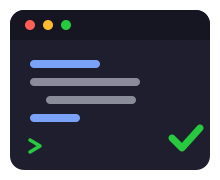
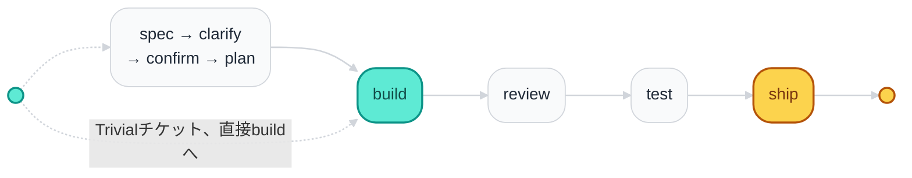

# ak

[](CHANGELOG.md)
[](LICENSE)
[](./docs/INSTALL.md)

[English](README.md) · [Tiếng Việt](README.vi.md) · **[日本語](README.ja.md)**

Claude Code、Cursor、Codex、Antigravity向けの**要件ファーストのAI開発ワークフロー**: 明確な仕様 →
人によるconfirm → TDD → 機械検証済みエビデンス → 安全なship。

## なぜ

ゲート付きプロセスがない場合、AIによるコーディングはよく次のような問題を起こす:

- ビジネスルールの見落とし
- UI/ロジックのバグをそのままship
- エビデンスなしに「完了」と表示する
- 実際にconfirmされた内容から逸脱する

akは、構造的ゲート **G0–G9** と必須の意味論的 **AUDIT** がPASSするまで先に進めないよう
ブロックする。チェッカー（`bin/check-gates.sh`）が唯一の真実の源であり、AIがPASSを自称することは
許されない。

## インストール

```bash
git clone https://github.com/trongdn2405/ak.git
cd ak
bash install.sh          # デフォルトはClaude Code — Cursor/Codex/Antigravityはdocs/INSTALL.mdを参照
```

その後、任意のプロジェクトで:

```text
/ak TICKET-123 https://tracker/TICKET-123
```

host別のインストール/更新/アンインストールの完全な手順: [docs/INSTALL.md](./docs/INSTALL.md)。

## フロー

`:start`（`/ak` の裸のエイリアスでもある）は1チケットに対する唯一のエントリーポイントだ —
一度だけ分析、一度だけ質問、その後最初の本当の停止点まで実行する。`learning`/`coaching` はこの
パイプラインの外で独立してドメイン知識を初期構築・修正する。



`review` と `ship` の間で、`fix` はOPENな指摘がある場合に実行され、`check` はゲートを検証し、
`clean` はその後worklogをアーカイブする — 完全なシーケンスと各stageの役割:
[docs/USER-GUIDE.md §3](./docs/USER-GUIDE.md#3-daily-flow-for-one-ticket)。「Trivial」には正確な定義
がある（Risk=P2、≤1ファイル、≤5行、公開識別子の変更なし、duplicate-scanクリーン）:
[docs/USER-GUIDE.md §3.2](./docs/USER-GUIDE.md#32-start-a-ticket)。

epic的なリクエストはまず `:decompose` を通り、childチケットに分割してから、このフローをchildごとに
繰り返す — その図と完全なstage別ガイドは [docs/USER-GUIDE.md](./docs/USER-GUIDE.md) を参照。

## コマンド

| コマンド | 効果 |
|---------|--------|
| `/ak:spec` | テスト可能なAC + Risk tier（P0/P1/P2） |
| `/ak:clarify` | spec/意図と実際の挙動を照合; 決定事項を記録 |
| `/ak:confirm` | 人によるサインオフ — plan/buildの前に必須 |
| `/ak:plan` / `:build` | TDDプラン + 実装 + カバレッジマップ |
| `/ak:review` / `:fix` | 中立的なdiffレビュー + トリアージ/修正 |
| `/ak:test` | 実際のテスト + 機械エビデンス（SHA/CI/junit） |
| `/ak:ship` | ship安全性チェックリスト（ゲートG9） |
| `/ak:audit` | 意味論的整合性チェック + 人によるサインオフ |

完全なコマンドリファレンス（全16コマンド、引数、各コマンドが単独で動作する条件）:
[docs/USER-GUIDE.md §4](./docs/USER-GUIDE.md#4-commands-cheat-sheet)。

## ゲートとリスク

10個の構造的ゲート（**G0–G9**）に加えて1つの意味論的 **AUDIT** が上記のフローを強制する; 3つのRisk
レーン（**P0** hard / **P1** hard / **P2** fast）がチケットにどれだけの手続きが必要かを決める。
権威ある定義は [references/stage-contract.md](./references/stage-contract.md) と
[references/risk.md](./references/risk.md) にあり、
[docs/USER-GUIDE.md §6](./docs/USER-GUIDE.md#6-gates-g0g9--audit-in-one-table) には読者向けの表がある。

## もっと詳しく

| ドキュメント | 内容 |
|-----|---------|
| **[docs/USER-GUIDE.md](./docs/USER-GUIDE.md)** | 日々の使い方の完全ガイド: セットアップ、日々のフロー、confirmフレーズ、worklogファイル、ゲート、パイロット |
| [docs/INSTALL.md](./docs/INSTALL.md) | インストール、更新、アンインストール、検証、host別パス |
| [MARKETPLACE.md](./MARKETPLACE.md) | host別インストール + smoke test |
| [STRUCTURE.md](./STRUCTURE.md) | 注釈付きリポジトリレイアウト |
| [CONTRIBUTING.md](./CONTRIBUTING.md) | プラグインを変更する方法 |
| [CHANGELOG.md](./CHANGELOG.md) | バージョン履歴 |
| [SECURITY.md](./SECURITY.md) | 脆弱性の報告 |
| [CODE_OF_CONDUCT.md](./CODE_OF_CONDUCT.md) | コミュニティ行動規範 |
| [references/](./references/) | ゲート、risk、security、pilot、enforcement — AI + 上級ユーザー向け |

## ライセンス

[MIT](LICENSE)
