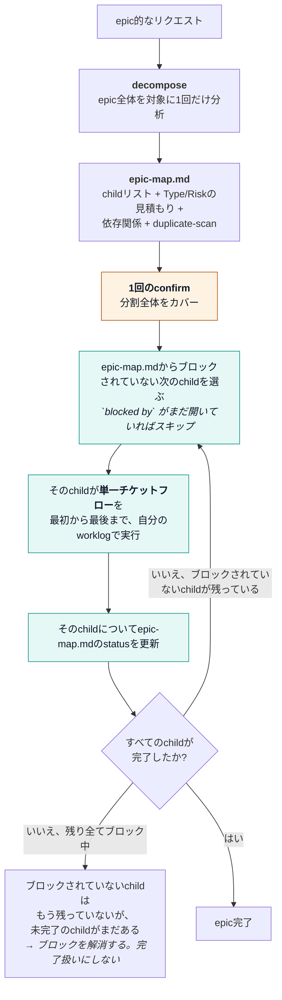

# ユーザーガイド — ak v0.4

[English](USER-GUIDE.md) · [Tiếng Việt](USER-GUIDE.vi.md) · **[日本語](USER-GUIDE.ja.md)**

このガイドはプラグインの**日々の使い方**を説明する。
インストール/更新については [INSTALL.md](./INSTALL.md) を参照。hostコマンドの一覧は
[MARKETPLACE.md](../MARKETPLACE.md)。設計レイアウトは [STRUCTURE.md](../STRUCTURE.md)。

---

## 1. このプラグインがすること

**要件ファースト**の道筋をコードの前に強制する:

1. ドメイン知識を学習/コーチングする
2. テスト可能な受け入れ基準（とRiskティア）を書く
3. 現行コードとの矛盾を検出する
4. **あなた**が決定事項を確認する（`CONFIRM G3:…`）
5. plan → build（TDD） → **中立的なコードレビュー** → 妥当な指摘だけ修正 → 機械証拠付きでテスト実行
6. shipの安全チェックリスト（G9）とcheckerのPASS
7. **意味論的audit**（`:audit`） — G9のPASSはすべてのフィールドが埋まっていてplaceholderでないことを
   意味するだけで、内容が論理的に一貫していること（Rollbackが本当にMigrationを取り消せるか、
   DecisionがProposalに実際に答えているか）は意味しない。`:audit`はshipが最終確定とみなされる前に
   必須となる、人間が確認する層である。

AIはPASSを自称してはならない。`bin/check-gates.sh`は構造の判定者であり、`:audit`とあなたの
サインオフは意味の判定者である — どちらも他方の代わりにはならない。

**言語:** チャット・セットアップは**あなたの言語**に従う（`references/locale.md`参照）。ゲートキーワード
（`CONFIRM G3:`、PASS/FAIL）は英語のまま。

**ワークスペース:** 各プロジェクトは`~/.workspaces/<slug>/`配下（製品リポジトリの外）; レイアウト検証は
`bin/check-workspace.sh`を実行。

**チケット単位:** ビルド/エビデンスは`worklogs/<Ticket_ID>/`内にのみ存在する — チケット間でworklogを共有しない。

**完了後:** `/ak:clean TICKET-123`でそのworklogをアーカイブする（ドメイン知識は保持）。

### 名前の紛らわしさに注意

| 単語 | 意味 | いつ |
|------|--------|------|
| **confirm**（`:confirm`、G3） | clarify/spec決定事項への人間のサインオフ | plan/buildの**前** |
| **review**（`:review`、G7） | 中立的なdiffレビュー + How/Byエビデンス | buildの**後** |
| **fix**（`:fix`） | reviewの指摘をトリアージ; 妥当な欠陥だけ修正 | review FAIL（P0/P1がOPEN）後 |
| **test**（`:test`、G8） | 実際のテスト実行 + SHA/CI/junit | review（必要なら`:fix`）の後 |
| **check**（`:check`） | `check-gates.sh`を実行 | ship/mergeの前 |
| **audit**（`:audit`） | 意味論的な整合性クロスチェック + 人によるサインオフ | G9 PASS後、shipが最終確定する前 |
| **clean**（`:clean`） | worklogをアーカイブ/削除; G9が下限、auditは依然としてP0/P1の最終性を決める | G9後; 必須auditの後を推奨 |

---

## 2. 初回セットアップ（マシンごとに一度）

前提条件: Bash 3.2以上、Git、サポート対象hostの少なくとも1つ。インストーラーはホームディレクトリ配下に
統合ファイルを書き込むが、製品ソースは編集しない。正確なパス、更新、分離されたsmoke test、
トラブルシューティングは [INSTALL.md](./INSTALL.md) を参照。

```bash
git clone https://github.com/trongdn2405/ak.git
cd ak
bash install.sh             # Claude Codeのみ（デフォルト）
bash install.sh --cursor    # Cursorのみ
bash install.sh --codex     # Codexのみ
bash install.sh --agy       # Antigravityのみ; agyが必要
bash install.sh --all       # 全host; agyが必要
```

1つのコマンドだけを選ぶこと（全行ではない）。選択したhostを再起動/リロードすること;
Codexの場合はインストールされたskillが検出されるよう新しいtaskを開始すること。

後でワークフローを削除するには、対応するコマンド（`bash uninstall.sh`、`--cursor`、`--codex`、`--agy`、
`--all`）を使う。host統合のみを削除する; cloneとworklogは保持される。
[INSTALL.md](./INSTALL.md#uninstall) に正確な削除契約がある。

更新するには、同じターゲットフラグで`bash update.sh`を実行する。updaterはクリーンなworktreeを要求し、
cloneをfast-forwardし、ローカルのリポジトリ変更に触れずにそのagentをrefreshする。失敗時の扱いと
検証方法は [INSTALL.md](./INSTALL.md#update) を参照。

その後、**製品**リポジトリで（推奨）:

1. `templates/ci/github-actions-ak.yml` → `.github/workflows/ak-gates.yml` にコピー
2. ブランチ保護 → ステータスチェック`ak-gates`を必須にする
3. プロジェクトルートに任意のマーカー:

```json
{ "projectSlug": "my-app" }
```

`.ak.json`として保存（`templates/workspaces/_project/ak.json.example`参照）。

Smoke test:

```bash
export AK_WORKSPACES_ROOT=/path/to/ak/fixtures
export AK_PLUGIN=/path/to/ak
"$AK_PLUGIN/bin/check-workspace.sh" demo
# expect RESULT: PASS
"$AK_PLUGIN/bin/check-gates.sh" PASS-G9 --project demo --min G9 --strict
# expect RESULT: PASS
```

---

## 3. 1チケットあたりの日々のフロー

### 3.0 epic的なリクエスト

リクエストがepic的な形をしている場合は `:decompose` が先に走り、その後1チケットフローをchildごとに
順番に引き渡す — これは単一チケットに使うのと同じフローをループするものだ
（そのダイアグラムは [README.md](../README.md) にある）:



`:decompose` はプロジェクトレベルで `epic-map.md` を書き込み（どのチケットのworklog内にも置かない）、
ブロックされていない**最初の**childだけを引き渡す — 複数childの `:spec`/`:start` を自分でまとめて
発行することはない。各childは自分自身の完全な単一チケットフロー（独自のRisk tier、独自の
`CONFIRM G3`、独自のG0–G9 + AUDIT）を持つ — epicの1回のconfirmは分割自体とepicレベルの質問だけを
承認するものであり、どのchildの独自ゲートも代替しない。decompose中に発見されたP0のchildは、他の方法
で見つかったP0チケットとまったく同じ厳格さでゲートされる。`epic-map.md` は多階層epic（child自体が
さらに分岐するケース）に対しては検証されていない — 依存グラフはフラットなchildリストに対してのみ
信頼できるものとして扱い、childがさらにdecomposeを必要としそうな場合はその旨を明示すること。

### 3.1 プロジェクトで初めて使うとき

```
/ak:learning
```

短いbriefを貼り付ける: プロジェクト名、リポジトリ、ドメイン。
AIは`~/.workspaces/<slug>/`を作成し、ビジネスルールが不明な場合は質問する。
AIが間違っている、またはspecが変わった場合は`/ak:coaching`で答える。

### 3.2 チケットを開始する

```
/ak TICKET-123 https://your-tracker/TICKET-123
```

AIは一度だけ分析し、一度だけ質問し、**最初の本当の停止点**まで実行する。各stageを手動で実行することもできる
（下記）。

**本当にtrivialな修正はその1回の質問すらスキップする。** チケットがRisk=P2で、≤1ファイル、≤5行、
公開識別子（関数/route/API/カラム名）を変更せず、duplicate-scanがクリーン（同期すべき他の出現箇所が
ない）で返ってきた場合、`:start`は先に聞かずに即座に`:build`を実行し、行った内容を事後報告する —
それを取り消してフルセレモニーでやり直してほしい場合は後で「full pipeline」と言えばよい。
このno-ask自動実行はduplicate-scanがクリーンな場合にのみ発火する; 別の出現箇所が見つかった場合、
`:start`は通常のP2の提案して待つに戻る。**このno-ask自動実行は`:start`専用**だ —
`/ak:build TICKET-123`を直接呼ぶと、Trivial形のチケットでも自己分析はするが、
事前報告をスキップしない。no-ask動作は`:start`のステップ1のオファーに宿っているからだ。
`references/risk.md`の"Trivial"を参照 — `≤5行`という閾値はepic-signalのclaim-countバックストップと
同様に扱われる、未検証の初期的な推測値である。

### 3.3 Spec（G1）

```
/ak:spec TICKET-123
```

`02-spec.md`に以下を含めて作成する必要がある:

- ちょうど1つの**Type:** Bug / New feature / Spec change / Requirement change / Refactor
- **Risk:** P0 / P1 / P2（必須）
- 要件の来歴: truth label、source/quote、検証日、confidence、未解決のowner
- Scenario AC行（Given / When / Then）が埋まっている
- 必要に応じてNEG / PERM / EDGE
- Touches UI = Yesの場合はUI states
- **P0**の場合: `02b-security.md`も記入
- Touches UI = Yesの場合: **QA handoff — testable oracle**テーブル（実際のフィールド/ボタンラベル +
  AC/NEG/PERM/EDGE行ごとの機械検証可能なoracle）を記入する。このプラグイン自体はQAを実行しない;
  このテーブルは次にテストする人（人間または外部ツール）がspecだけからテストケースを設計できるように
  するためのものであり、フィールドの名前や画面上の「成功」の意味を開発者に尋ねる必要がないようにする。
  画面がまだ設計されていない場合は行を`TBD`とマークする。空欄のままにしない。

**Riskの選び方**

| 選択 | いつ |
|--------|------|
| **P0** | 金銭、authz/権限、PII、レガシーデータ、不可逆的なmigration |
| **P1** | 通常の挙動 / API変更（デフォルト） |
| **P2** | コピー、config、docs、小さな非挙動的chore |

### 3.4 Clarify（G2）

```
/ak:clarify TICKET-123
```

`03-clarify-report.md` + `03-qa-log.md`を記入する。
MATCHでないものはすべてdecision + owner + dateが必要。AIはすべてのopenな質問を1つの短い番号付き
リストとしてまとめて尋ねる — 平易な言葉で、どんな順序でもよいので1つのメッセージで返信する; AIは
あなたの回答を正しい質問に一致させ、まだ未解決のものだけを再度尋ねる。

Typeによって調査内容が変わる: Bugは実際の実行パスをたどる; New featureは1つの類似実装と挿入ポイントを
調査する; Spec changeはすべての消費者をたどる; Requirement changeは旧/新ルールのすべてのエンコードを
見つけ、名前付きauthorityを要求する。混合チケットは各claimを個別に分類する。

**Duplicate-scanはすべてのチケットで実行される。Spec/Requirement changeだけではない** — Bug fixや
P2のコピー修正も、他の場所で重複しているtextやlogicに同じように触れる可能性がある。どのclaimを
クローズする前にも: コードベース全体で同じ文字列（copy/label/message）または同じlogic（validation
rule、calculation、permission check）をgrepする。複数の出現箇所が見つかった場合はあなたへの質問
（「これらを同期させますか？」）になる。どちらの方向にも黙って決定することはない。
`references/ba-integrity.md`の"Duplicate-scan"を参照。

### 3.5 Confirm（G3） — **あなたがこれを送り返す**

```
/ak:confirm TICKET-123
```

AIは決定事項を要約し、チケットと日付がすでに記入済みの送信準備完了の行を渡す — あなたは名前を編集して
送り返すだけだ:

```text
CONFIRM G3: TICKET-123 Your Name 2026-08-11
```

Risk = **P0**の場合、さらに:

```text
CONFIRM G3-PM: TICKET-123 PM Name 2026-08-11
```

**この行をそのまま正確に打ち返す必要はない。** 明らかに同意と読める返信 — 名前だけ、「ok Hoa」、
「đồng ý, tên tôi là Hoa」 — であれば十分だ。AIはあなたの返信から正確な行を構成し、それが記録になる前に
一度見せて確認する。あなたが異議を唱えなければ、その見せられた行が記録になる。返信が明らかに同意と
読めない場合、AIは推測せずに直接yes/noを尋ねる。

ルール:

- AIは**これらの行を自ら作ってはならない**
- 禁止された名前: AI、ChatGPT、Claude、Copilot、Cursor、Assistant、Bot
- フレーズは`INDEX.md`と`03b-human-confirm.md`の**両方**に現れなければならない
- `03b-human-confirm.md`は`Source: user-message`を含まなければならない

### 3.6 Plan → Build → Review → Fix → Test

```
/ak:plan   TICKET-123
/ak:build  TICKET-123
/ak:review TICKET-123
/ak:fix    TICKET-123   # P0/P1の指摘がOPENの場合のみ
/ak:test   TICKET-123
```

| Stage | アーティファクト | 含めるべき内容 |
|-------|----------|--------------|
| plan | `04-plan.md` | AC/claimにマップされたタスク + 実行可能なコマンド発見の証拠 |
| build | `05-impl-log.md` | RED失敗/理由 → GREEN結果 + カバレッジマップ + SHA |
| review | `06-review-qa.md` | 欠陥クラスの網羅的チェック + 指摘（`path:line`） + ACごとのHow/By |
| fix | `06c-fix-log.md` | トリアージ FIX/SKIP/DEFER; 妥当なpatchのみ |
| test | `06b-test-evidence.md` | 実行コマンド台帳、assertionエビデンス、出力、SHA、CI/junit |

**Reviewのスタンス:** 推測されたframeworkの慣習ではなく**diff**を判断する。500 / missing / injection /
case（`downcase`/`upcase`）を狩る。P0/P1がOPEN → `:test`の前に`:fix`を実行。
**Fixのスタンス:** style-only、scope外、またはAC/systemと矛盾する提案はSKIPする; PM waiverなしにP0を
SKIPしない。

### 3.7 Check + Ship（mergeゲート）

```
/ak:check TICKET-123
/ak:ship  TICKET-123
```

mergeの前に、ターミナル（またはCI）から:

```bash
export AK_PLUGIN=/path/to/ak
"$AK_PLUGIN/bin/check-gates.sh" TICKET-123 --project <slug> --min G9 --strict
```

`--strict`はCIネイティブなチェック（SHA vs git HEAD、junit parse）を有効にし、`--verify-net`を含意する。

Shipアーティファクト`07-ship.md`はまずdeploymentプロファイルを選び、次に関連するmigration、
feature flag、**canary %**、**soak time**、on-call、SLO、rollback、実行authority、observableな
abort signalをカバーする。
Canary `N/A`には10文字以上の理由が必要（「abc abc abc」のような繰り返しplaceholderは不可）。

### 3.7.5 Audit（意味論的整合性、shipが最終確定する前）

```
/ak:audit TICKET-123
```

G9の構造的PASSはフィールドが埋まっていてplaceholderでないことを証明するだけであり、内容が
論理的に一貫していることは証明しない。`:audit`は両側からの引用エビデンスとともに8つの整合性ペア
（DecisionとProposal、RollbackとMigration、テストパスとそれが対象と主張するAC、…）をクロスチェックし、
実際の人間によるサインオフを要求する:

```
AUDIT CONFIRM: TICKET-123 <your name> <YYYY-MM-DD>
```

`CONFIRM G3:`と同じ偽造防止ルール — AI/ツール名は拒否される。AI自身によるauditへの自己の判定では
不十分だ; それこそがこのstageが一段上で捕まえようとしている盲点そのものだ。
すべてのC1–C8セクションは、両側からの逐語的なエビデンス引用2つ、placeholderでない理由、そして
確定したCOHERENT/N/A判定を要求する。欠落、UNCLEAR、またはINCOHERENTなペアがあればPASSをブロックする。

```bash
"$AK_PLUGIN/bin/check-gates.sh" TICKET-123 --project <slug> --min AUDIT --strict
```

### 3.8 Clean（チケット後にメモリを解放）

```
/ak:clean TICKET-123
```

- デフォルト: **アーカイブ** `worklogs/TICKET-123/` → `worklogs/.archive/TICKET-123-<UTC>/`
- `domain-knowledge/`、`PROJECT.md`、他のチケットは保持
- `--force`なしではG9 PASSが必要（`clean-worklog.sh`は`--min G9`をチェックする。これはすべてのrisk
  tierに共通の必須下限だ — `:audit`はP0/P1でshipが*最終*確定する前に必須だが、`:clean`自体の前提条件
  ではない。P2チケットは正当にauditをスキップできるため）
- ハード削除: `--purge`（チャットで先に確認）

CLI:

```bash
"$AK_PLUGIN/bin/clean-worklog.sh" TICKET-123 --project <slug>
"$AK_PLUGIN/bin/clean-worklog.sh" TICKET-123 --project <slug> --force --purge
```

### 3.9 Feedback（akのバグを報告する）

```
/ak:feedback [what went wrong]
```

- **ak自体**が誤動作したとき使う — skillの出力、gate、生成されたアーティファクトなど —
  あなたが構築している製品/チケットのバグではない。
- このセッションで説明したことをすべて集約し、`gh issue list`で既存の重複がないか確認してから、
  各title/bodyの確認を求める。
- `gh issue create --repo trongdn2405/ak`経由でファイルする; issueのURLを報告する。または
  項目がスキップされた理由（重複、却下）を報告する。
- `gh`のインストールと認証が必要（`gh auth status`）。認証済みの任意のGitHubアカウントは公開リポジトリで
  issueを開ける — write accessは不要。

---

## 4. コマンド早見表

| コマンド | いつ使うか | あなたが提供する必要があるもの |
|---------|-------------|------------------|
| `:learning` | 新しいプロジェクト / 空のknowledge | Briefまたはpath |
| `:coaching` | AIが間違っている / specが変わった | Topic + correction |
| `:start` | チケットを開始 | Ticket IDは任意（省略時は導出）; + URL |
| `:spec` | 要件を明確化 | Ticket IDは任意（省略時は導出）; Riskを設定 |
| `:clarify` | Spec vs code | Ticket IDは任意（省略時は導出） |
| `:confirm` | plan/codeの前 | **あなたの**`CONFIRM G3:…` |
| `:plan` | G3 PASS後 | Ticket IDは任意（省略時は導出） |
| `:build` | 実装 | Ticket IDは任意（省略時は導出） |
| `:review` | Diffレビュー + エビデンス | Ticket ID |
| `:fix` | reviewの指摘をトリアージ/修正 | Ticket ID（OPENなP0/P1の後） |
| `:test` | 実際のテスト実行 | Ticket ID + 機械フィールド |
| `:check` | checkerを実行 | Ticket ID; 任意でslug / G8\|G9\|AUDIT |
| `:ship` | merge前のノート | Ticket ID |
| `:audit` | 意味論的整合性 + 人によるサインオフ | Ticket ID（G9 PASS後） |
| `:clean` | チケットworklogをアーカイブ/削除 | Ticket ID; 任意で`--force` / `--purge` |
| `:status` | 今どこにいるか？ | Ticket ID（任意） |
| `:feedback` | akのバグ/不満点を報告 | 自由記述 |

Ticket IDがない？`:start`/`:spec`/`:clarify`/`:plan`/`:build`はそれでも実行される — 何も拒否されない。
作業に記録すべき決定が必要な場合、AIはタスク自体から短い`adhoc-<slug>`名を導出し、一度だけ知らせる。
何も永続化する必要がない場合（質問、read-onlyのlookup、クリーンに解決するclaim）、worklogは書かれず、
名前も作られない。

---

## 5. Worklogファイル（チケットごと）

`~/.workspaces/<project-slug>/worklogs/<Ticket_ID>/`配下に作成される:

| ファイル | 役割 | Gate |
|------|------|------|
| `INDEX.md` | Status、Type、Risk、Pilot、waiver、CONFIRM行 | すべて |
| `02-spec.md` | Intent、Type/Risk、provenance、AC/NEG/PERM/EDGE、UI oracle | G1 |
| `02b-security.md` | Threat / secrets / contract（**P0のみ**） | G1 |
| `03-clarify-report.md` | Claims MATCH/NO/UNCLEAR | G2 |
| `03-qa-log.md` | Open questions | G5 |
| `03b-human-confirm.md` | 正確な人間のCONFIRMテキスト | G3 |
| `04-plan.md` | Tasks | G4 |
| `05-impl-log.md` | カバレッジマップ | G6 |
| `06-review-qa.md` | Diffの指摘 + How verified | G7 |
| `06c-fix-log.md` | トリアージ / 適用されたfix | (remediation) |
| `06b-test-evidence.md` | Tests + SHA/CI/junit | G8 |
| `07-ship.md` | Ship safety | G9 |
| `08-semantic-audit.md` | Coherenceペア + 人による`AUDIT CONFIRM:`サインオフ | AUDIT |

---

## 6. Gate（G0–G9 + AUDIT）一覧

このテーブルは読者向けの要約である。`references/stage-contract.md`が権威ある情報源だ — 両者が
食い違う場合はcontractファイルが優先される; まずそちらを編集してから、このテーブルを同期すること。

| Gate | PASSの意味 | FAILなら実行 |
|------|------------|-------------|
| G0 | ドメイン知識の準備完了 | `:learning` / `:coaching` |
| G1 | 1つのType + Risk、provenance、AC（+ P0ならsecurity） | `:spec` |
| G2 | 矛盾が決定済み | `:clarify` |
| G3 | INDEXと`03b`に人によるCONFIRM | `:confirm` |
| G4 | プランがマップ済み | `:plan` |
| G5 | OPENな質問なし | `:clarify` |
| G6 | カバレッジ + テストがPASSでログ済み | `:build` |
| G7 | Review: OPENなP0/P1なし + エビデンス記入済み | `:review` / `:fix` |
| G8 | テストエビデンス + 機械フィールド | `:test` |
| G9 | Ship safetyが完了 | `:ship` |
| AUDIT | 構造PASS（G0–G9）は必要条件だが十分条件ではない — これはworklog自身のclaimが互いに一致しているか
（RollbackとMigration、DecisionとProposal、…）をチェックし、AIの判定だけでなく実際の人間による
`AUDIT CONFIRM:`サインオフを要求する | `:audit` |

**P2 fast lane:** G2/G3/G4/G5/G7は`--strict`でなければsoft（warn） — 小さく非挙動的なP2チケットは
人間による`CONFIRM G3`のラウンドトリップを完全にスキップできる。
**Trivial（P2フィルタであり、新しいtierではない）:** ≤1ファイル、≤5行、公開識別子の変更なし、
duplicate-scanクリーン → `:start`はP2の提案して待つステップすらスキップし、そのまま`:build`を実行し、
事後に報告する。duplicate-scanが他の出現箇所を見つけた場合は通常のP2にフォールバックする。
`references/risk.md`の"Trivial"を参照。
**P0:** G3/G8にWAIVEなし; 二重confirm; securityファイル必須。
**P0/P1の最終性:** G9は構造的; AUDIT + 人によるサインオフが必要。

INDEXでのWAIVE行フォーマット:

```text
- G4/task-3 | reason | owner | 2026-12-31 | PM note
```

---

## 7. Pilot（ワークフローが機能することを証明する）

1. `templates/pilot-metrics.md` → `~/.workspaces/<slug>/pilot/PILOT-v0.4.md`にコピー
2. **Scores (machine)**ブロックにbaseline数値を記入
3. pilotチケットではINDEXで`Pilot: ☑ yes`を設定
4. 10チケット後:

```bash
./bin/pilot-score.sh ~/.workspaces/<slug>/pilot/PILOT-v0.4.md
# expect RESULT: PASS
```

成功基準: miss-spec / reopen / escapeそれぞれがbaselineの半分以下; `gate_blocks ≥ 1`;
`tickets_completed ≥ 10`。

---

## 8. トラブルシューティング

| 症状 | 修正方法 |
|---------|-----|
| `worklog not found` | 製品プロジェクトに`cd`する、または`AK_WORKSPACES_ROOT` / `--project <slug>`を設定する |
| G3 FAIL CONFIRM欠落 | 正確なフレーズを入力する; INDEXと`03b-human-confirm.md`の両方に存在することを確認する |
| G3 FAIL AI名 | Claude/Cursor/…ではなく実際の人間の名前を使う |
| G8 FAIL SHA | 実際の`git rev-parse HEAD`を機械エビデンステーブルに入れる |
| G8 FAIL junit | Pathが存在すること; XMLに`failures="0"`があること |
| G9 FAIL canary N/A | 理由を追加: `N/A (internal tool, no canary)` |
| AUDIT FAIL quoted evidence | すべてのC1–C8ペアに2つの正確なsource quoteと実際のREASONを追加する |
| インストール済みコマンドが見つからない | hostを再起動/リロードする; installerを再実行する; `INSTALL.md`のpathを確認する |
| CheckerがPASSしているのにPRがそれなしでmergeされる | CIテンプレートからrequired status checkを有効にする |

---

## 9. 関連ドキュメント

| Doc | 内容 |
|-----|-----|
| [README.md](../README.md) | 概要 + インストール + コマンド一覧 |
| [INSTALL.md](./INSTALL.md) | インストール、更新、検証、hostごとのpath |
| [references/risk.md](../references/risk.md) | P0/P1/P2 + timebox |
| [references/security.md](../references/security.md) | P0 securityファイルのルール |
| [references/pilot.md](../references/pilot.md) | Pilot運用 |
| [references/maturity.md](../references/maturity.md) | Expert rubric |
| [references/enforce.md](../references/enforce.md) | Checkerのフラグ |
| [MARKETPLACE.md](../MARKETPLACE.md) | Hostインストール |
| [CONTRIBUTING.md](../CONTRIBUTING.md) | プラグインを開発する |
