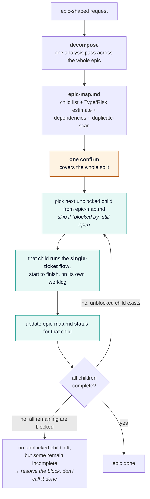

# User guide — ak v0.4

**[English](USER-GUIDE.md)** · [Tiếng Việt](USER-GUIDE.vi.md) · [日本語](USER-GUIDE.ja.md)

This guide explains **how to use** the plugin day-to-day.
For installation/update, see [INSTALL.md](./INSTALL.md). For the host command summary, see
[MARKETPLACE.md](../MARKETPLACE.md). For the design layout, see [STRUCTURE.md](../STRUCTURE.md).

---

## 1. What this plugin does

Forces a **requirement-first** path before code:

1. Learn / coach domain knowledge
2. Write testable acceptance criteria (and a Risk tier)
3. Detect conflicts with current code
4. **You** confirm decisions (`CONFIRM G3:…`)
5. Plan → build (TDD) → **neutral code review** → fix justified findings → run tests with machine proof
6. Ship safety checklist (G9) and checker PASS
7. **Semantic audit** (`:audit`) — G9 PASS means every field is filled and not a placeholder; it
   does not mean the content is logically consistent (that Rollback actually undoes Migration, or
   that Decision actually answers Proposal). `:audit` is the required human-confirmed layer on top
   before ship is treated as final.

The AI must not invent a PASS. `bin/check-gates.sh` is the judge of structure; `:audit` plus your
sign-off is the judge of meaning — neither substitutes for the other.

**Language:** chat + setup follow **your language** (see `references/locale.md`). Gate keywords (`CONFIRM G3:`, PASS/FAIL) stay English.

**Workspaces:** each project under `~/.workspaces/<slug>/` (outside product repo); run `bin/check-workspace.sh` to verify layout.

**Per ticket:** build/evidence live only in `worklogs/<Ticket_ID>/` — tickets do not share worklogs.

**After done:** `/ak:clean TICKET-123` archives that worklog (keeps domain knowledge).

### Naming (easy to mix up)

| Word | Means | When |
|------|--------|------|
| **confirm** (`:confirm`, G3) | Human sign-off on clarify/spec decisions | **Before** plan/build |
| **review** (`:review`, G7) | Neutral diff review + How/By evidence | **After** build |
| **fix** (`:fix`) | Triage review findings; fix only justified defects | After review FAIL (P0/P1 OPEN) |
| **test** (`:test`, G8) | Real test run + SHA/CI/junit | After review (and `:fix` if needed) |
| **check** (`:check`) | Run `check-gates.sh` | Before ship/merge |
| **audit** (`:audit`) | Semantic coherence cross-check + human sign-off | After G9 PASS, before ship is final |
| **clean** (`:clean`) | Archive/purge worklog; G9 floor, audit still determines P0/P1 finality | After G9; recommended after required audit |

---

## 2. First-time setup (once per machine)

Prerequisites: Bash 3.2+, Git, and at least one supported host. The installer writes integration
files under your home directory but does not edit product source. Read [INSTALL.md](./INSTALL.md)
for exact paths, updates, isolated smoke testing, and troubleshooting.

```bash
git clone https://github.com/trongdn2405/ak.git
cd ak
bash install.sh             # Claude Code only (default)
bash install.sh --cursor    # Cursor only
bash install.sh --codex     # Codex only
bash install.sh --agy       # Antigravity only; requires agy
bash install.sh --all       # all hosts; requires agy
```

Choose one command, not every line. Restart/reload the selected host afterward; for Codex, start a
new task so the installed skills are discovered.

To remove the workflow later, use the matching command (`bash uninstall.sh`, `--cursor`, `--codex`,
`--agy`, or `--all`). It removes host integration only; the clone and worklogs are preserved. See
[INSTALL.md](./INSTALL.md#uninstall) for the exact removal contract.

To update, run `bash update.sh` with the same target flag. The updater requires a clean worktree,
fast-forwards the clone, and refreshes that agent without touching local repository changes. See
[INSTALL.md](./INSTALL.md#update) for failure handling and verification.

Then in your **product** repo (recommended):

1. Copy `templates/ci/github-actions-ak.yml` → `.github/workflows/ak-gates.yml`
2. Branch protection → require status check `ak-gates`
3. Optional marker at project root:

```json
{ "projectSlug": "my-app" }
```

Save as `.ak.json` (see `templates/workspaces/_project/ak.json.example`).

Smoke test:

```bash
export AK_WORKSPACES_ROOT=/path/to/ak/fixtures
export AK_PLUGIN=/path/to/ak
"$AK_PLUGIN/bin/check-workspace.sh" demo
# expect RESULT: PASS
"$AK_PLUGIN/bin/check-gates.sh" PASS-G9 --project demo --min G9 --strict
# expect RESULT: PASS
```

---

## 3. Daily flow for one ticket

### 3.0 Epic-shaped requests

`:decompose` runs first when a request is epic-shaped, then hands off the single-ticket flow one
child at a time — it loops the same flow used for any single ticket ([README.md](../README.md) has
that diagram):



`:decompose` writes `epic-map.md` at the project level (not inside any one ticket's worklog) and
hands off only the **first** unblocked child — it never dispatches multiple children's
`:spec`/`:start` itself. Each child gets its own full single-ticket flow (own Risk tier, own
`CONFIRM G3`, own G0–G9 + AUDIT) — the epic's one confirm authorizes the split and the epic-level
questions; it does not substitute for any child's own gates. A P0 child found during decomposition is
exactly as hard-gated as a P0 ticket found any other way. `epic-map.md` has not been validated
against a multi-level epic (children that themselves fan out) — treat the dependency graph as
reliable for a flat child list only, and say so explicitly if a child looks like it needs
decomposing again.

### 3.1 First time on a project

```
/ak:learning
```

Paste a short brief: project name, repos, domains.  
AI creates `~/.workspaces/<slug>/` and asks when business rules are unclear.  
You answer with `/ak:coaching` when AI is wrong or specs change.

### 3.2 Start a ticket

```
/ak TICKET-123 https://your-tracker/TICKET-123
```

AI analyzes once, asks once, then runs to the **first genuine stop**. You can also run stages
manually (below).

**Trivial fixes skip even that one ask.** If the ticket is Risk=P2, touches ≤1 file, ≤5 lines, changes
no public identifier (function/route/API/column name), and the duplicate-scan comes back clean (no
other occurrence to keep in sync), `:start` runs `:build` immediately and reports what it did instead
of asking first — say `"full pipeline"` afterward if you want it undone and redone with full ceremony.
This only fires when the duplicate-scan is clean; if it finds another occurrence, `:start` falls back
to the normal P2 offer-and-wait. **This no-ask auto-run is `:start`-only** — calling
`/ak:build TICKET-123` directly still self-analyzes on a Trivial-shaped ticket, but it
doesn't skip reporting first, since `:start`'s step-1 offer is what the no-ask behavior lives on.
See `references/risk.md` "Trivial" — the `≤5 lines` threshold is an
unvalidated starting guess, tracked the same way as the epic-signal claim-count backstop.

### 3.3 Spec (G1)

```
/ak:spec TICKET-123
```

Must produce `02-spec.md` with:

- Exactly one **Type:** Bug / New feature / Spec change / Requirement change / Refactor
- **Risk:** P0 / P1 / P2 (required)
- Requirement provenance: truth label, source/quote, verification date, confidence, unresolved owner
- Scenario AC rows (Given / When / Then) filled
- NEG / PERM / EDGE as needed
- UI states if Touches UI = Yes
- If **P0**: also fill `02b-security.md`
- If Touches UI = Yes: fill the **QA handoff — testable oracle** table (real field/button
  labels + machine-checkable oracle per AC/NEG/PERM/EDGE row). This plugin does not run QA
  itself; this table is so whoever tests next (human or an external tool) can design test cases
  from the spec alone, without asking the dev what a field is called or what "success" means on
  screen. Screen not designed yet → mark the row `TBD`, don't leave it blank.

**How to choose Risk**

| Choose | When |
|--------|------|
| **P0** | Money, authz/permission, PII, legacy data, irreversible migration |
| **P1** | Normal behavior / API change (default) |
| **P2** | Copy, config, docs, tiny non-behavioral chore |

**P0 is the only hard-gated tier.** P1 and P2 share the same fast lane: G2/G3/G4/G5/G7 soften to
warn-only (no mid-flow `CONFIRM G3` stop) unless you pass `--strict`. `:audit` after G9 stays the
one human sign-off point for P1/P2 — see `references/risk.md` for the full rationale.

### 3.4 Clarify (G2)

```
/ak:clarify TICKET-123
```

Fills `03-clarify-report.md` + `03-qa-log.md`.  
Every non-MATCH needs decision + owner + date. AI asks all open questions as one short numbered
list — reply in plain language, any order, in one message; AI matches your answers to the right
questions and re-asks only what's still unresolved.

Investigation changes by Type: Bug follows the real execution path; New feature surveys one analog
and insertion points; Spec change traces every consumer; Requirement change finds every encoding of
the old/new rule and requires named authority. Mixed tickets classify each claim separately.

**Duplicate-scan runs on every ticket, not just Spec/Requirement change** — a Bug fix or a P2 copy
tweak can just as easily touch text or logic duplicated elsewhere. Before closing any claim: grep
for the same string (copy/label/message) or the same logic (validation rule, calculation,
permission check) across the codebase. Found more than one occurrence → becomes a question for you
("keep these in sync?"), not a silent decision either way. See `references/ba-integrity.md`
"Duplicate-scan".

### 3.5 Confirm (G3) — **you send this back**

```
/ak:confirm TICKET-123
```

AI summarizes the decisions, then hands you a ready-to-send line with the ticket and date already
filled in — you just edit the name and send it back:

```text
CONFIRM G3: TICKET-123 Your Name 2026-08-11
```

If Risk = **P0**, also:

```text
CONFIRM G3-PM: TICKET-123 PM Name 2026-08-11
```

**You don't have to type the line back exactly.** Any reply that clearly reads as agreement — a
bare name, `"ok Hoa"`, `"đồng ý, tên tôi là Hoa"` — is enough. AI composes the exact line from your
reply and shows it back once so you see exactly what gets written; that shown-back line becomes the
record once you don't contest it. If your reply doesn't clearly read as agreement, AI asks a direct
yes/no instead of assuming.

Rules:

- AI **must not invent** these lines  
- Forbidden names: AI, ChatGPT, Claude, Copilot, Cursor, Assistant, Bot  
- Phrases must appear in **both** `INDEX.md` and `03b-human-confirm.md`  
- `03b-human-confirm.md` must contain `Source: user-message`

### 3.6 Plan → Build → Review → Fix → Test

```
/ak:plan   TICKET-123
/ak:build  TICKET-123
/ak:review TICKET-123
/ak:fix    TICKET-123   # only if P0/P1 findings OPEN
/ak:test   TICKET-123
```

| Stage | Artifact | Must include |
|-------|----------|--------------|
| plan | `04-plan.md` | Tasks mapped to AC/claims + runnable command discovery proof |
| build | `05-impl-log.md` | RED failure/reason → GREEN result + coverage map + SHA |
| review | `06-review-qa.md` | Defect class sweep + findings (`path:line`) + How/By per AC |
| fix | `06c-fix-log.md` | Triage FIX/SKIP/DEFER; only justified patches |
| test | `06b-test-evidence.md` | Executed-command ledger, assertion evidence, output, SHA, CI/junit |

**Review stance:** judge the **diff**, not guessed framework habits. Hunt 500 / missing / injection / case (`downcase`/`upcase`). P0/P1 OPEN → run `:fix` before `:test`.  
**Fix stance:** SKIP style-only, out-of-scope, or suggestions that contradict AC/system; never SKIP P0 without PM waiver.

### 3.7 Check + Ship (merge gate)

```
/ak:check TICKET-123
/ak:ship  TICKET-123
```

Before merge, from terminal (or CI):

```bash
export AK_PLUGIN=/path/to/ak
"$AK_PLUGIN/bin/check-gates.sh" TICKET-123 --project <slug> --min G9 --strict
```

`--strict` turns on CI-native checks (SHA vs git HEAD, junit parse) and implies `--verify-net`.

Ship artifact `07-ship.md` first selects a deployment profile, then covers relevant migration,
feature flag, **canary %**, **soak time**, on-call, SLO, rollback, execution authority, and observable
abort signal.
Canary `N/A` needs a reason ≥ 10 characters (and must not be a repeated placeholder like "abc abc abc").

### 3.7.5 Audit (semantic coherence, before ship is final)

```
/ak:audit TICKET-123
```

G9 structural PASS only proves fields are filled and not placeholders — it does not prove the
content is logically consistent. `:audit` cross-checks 8 coherence pairs (Decision vs Proposal,
Rollback vs Migration, test paths vs the AC they claim to cover, …) with quoted evidence from both
sides, then requires a real human sign-off:

```
AUDIT CONFIRM: TICKET-123 <your name> <YYYY-MM-DD>
```

Same anti-forge rule as `CONFIRM G3:` — AI/tool names are rejected. An AI's own verdict on its own
audit is not enough; that is exactly the blind spot this stage exists to catch, one level up.
Every C1–C8 section requires two verbatim evidence quotes, a non-placeholder reason, and a resolved
COHERENT/N/A verdict. Any missing, UNCLEAR, or INCOHERENT pair blocks PASS.

```bash
"$AK_PLUGIN/bin/check-gates.sh" TICKET-123 --project <slug> --min AUDIT --strict
```

### 3.8 Clean (free memory after ticket)

```
/ak:clean TICKET-123
```

- Default: **archive** `worklogs/TICKET-123/` → `worklogs/.archive/TICKET-123-<UTC>/`
- Keeps `domain-knowledge/`, `PROJECT.md`, other tickets
- Requires G9 PASS unless `--force` (`clean-worklog.sh` checks `--min G9`, the mandatory floor for
  every risk tier — `:audit` is required before ship is *final* on P0/P1 but is not itself a
  `:clean` precondition, since P2 tickets may legitimately skip audit)
- Hard delete: `--purge` (confirm in chat first)

CLI:

```bash
"$AK_PLUGIN/bin/clean-worklog.sh" TICKET-123 --project <slug>
"$AK_PLUGIN/bin/clean-worklog.sh" TICKET-123 --project <slug> --force --purge
```

### 3.9 Feedback (report a ak bug)

```
/ak:feedback [what went wrong]
```

- Use when **ak itself** misbehaves — a skill's output, a gate, a generated artifact —
  not a bug in the product/ticket you are building.
- Aggregates whatever you've described this session, checks `gh issue list` for an existing
  duplicate, then asks you to confirm each title/body before filing.
- Files via `gh issue create --repo trongdn2405/ak`; reports back the issue URL(s), or the
  reason an item was skipped (duplicate, declined).
- Requires `gh` installed and authenticated (`gh auth status`). Any authenticated GitHub account
  can open an issue on a public repo — write access is not required.

### 3.10 Flow diagram (bug/UI-flow reproduction)

```
/ak:flow-diagram [logs / bug description / route+controller context]
```

- Standalone utility, not part of G0–G9 — no ticket/worklog required.
- Reconstructs the reported UI flow and each bug as a plain-text Unicode box-drawing diagram
  (Senior QA Automation / Tech Lead persona): role/account stated, concrete fake login
  credentials, `[Action hiện tại]`/`[Action tiếp theo]` prefixes, a dedicated
  `📍🌐🎯💡` block per bug grounded in the real code. N bugs in the input → N independent diagrams.
- **Never asks mid-task.** It filters noise, makes the best-supported call, and delivers the
  finished diagram(s) in one response — you review the result and decide what to do with it, the
  same way `:confirm`/`:audit` are the only points where you're asked to decide something.
- Format spec + full example: [references/flow-diagram.md](../references/flow-diagram.md).

---

## 4. Commands cheat sheet

| Command | When to use | You must provide |
|---------|-------------|------------------|
| `:learning` | New project / empty knowledge | Brief or path |
| `:coaching` | AI wrong / spec changed | Topic + correction |
| `:start` | Begin ticket | Ticket ID optional (derived if omitted); + URL |
| `:spec` | Clarify requirements | Ticket ID optional (derived if omitted); set Risk |
| `:clarify` | Spec vs code | Ticket ID optional (derived if omitted) |
| `:confirm` | Before any plan/code | **Your** `CONFIRM G3:…` |
| `:plan` | After G3 PASS | Ticket ID optional (derived if omitted) |
| `:build` | Implement | Ticket ID optional (derived if omitted) |
| `:review` | Diff review + evidence | Ticket ID |
| `:fix` | Triage/fix review findings | Ticket ID (after OPEN P0/P1) |
| `:test` | Real test run | Ticket ID + machine fields |
| `:check` | Run checker | Ticket ID; optional slug / G8\|G9\|AUDIT |
| `:ship` | Pre-merge notes | Ticket ID |
| `:audit` | Semantic coherence + human sign-off | Ticket ID (after G9 PASS) |
| `:clean` | Archive/purge ticket worklog | Ticket ID; optional `--force` / `--purge` |
| `:status` | Where am I? | Optional Ticket ID |
| `:feedback` | Report a ak bug/pain point | Free text description |
| `:flow-diagram` | Bug/UI-flow reproduction diagram | Logs/description; never asks mid-task |

No Ticket ID? `:start`/`:spec`/`:clarify`/`:plan`/`:build` still run — nothing is refused. If the
work needs a decision recorded, the AI derives a short `adhoc-<slug>` name from the task itself
(e.g. `adhoc-confirm-btn-text`) and tells you once. If nothing needs persisting (a question, a
read-only lookup, a claim that resolves clean), no worklog is written and no name is invented.

---

## 5. Worklog files (per ticket)

Created under `~/.workspaces/<project-slug>/worklogs/<Ticket_ID>/`:

| File | Role | Gate |
|------|------|------|
| `INDEX.md` | Status, Type, Risk, Pilot, waivers, CONFIRM lines | all |
| `02-spec.md` | Intent, Type/Risk, provenance, AC/NEG/PERM/EDGE, UI oracles | G1 |
| `02b-security.md` | Threat / secrets / contract (**P0 only**) | G1 |
| `03-clarify-report.md` | Claims MATCH/NO/UNCLEAR | G2 |
| `03-qa-log.md` | Open questions | G5 |
| `03b-human-confirm.md` | Exact human CONFIRM text | G3 |
| `04-plan.md` | Tasks | G4 |
| `05-impl-log.md` | Coverage map | G6 |
| `06-review-qa.md` | Diff findings + How verified | G7 |
| `06c-fix-log.md` | Triage / applied fixes | (remediation) |
| `06b-test-evidence.md` | Tests + SHA/CI/junit | G8 |
| `07-ship.md` | Ship safety | G9 |
| `08-semantic-audit.md` | Coherence pairs + human `AUDIT CONFIRM:` sign-off | AUDIT |

---

## 6. Gates (G0–G9 + AUDIT) in one table

This table is a reader-facing summary. `references/stage-contract.md` is the authoritative
source — if the two disagree, the contract file wins; edit it first, then sync this table.

| Gate | PASS means | If FAIL run |
|------|------------|-------------|
| G0 | Domain knowledge ready | `:learning` / `:coaching` |
| G1 | One Type + Risk, provenance, ACs (+ security if P0) | `:spec` |
| G2 | Conflicts decided | `:clarify` |
| G3 | Human CONFIRM in INDEX + `03b` | `:confirm` |
| G4 | Plan mapped | `:plan` |
| G5 | No OPEN questions | `:clarify` |
| G6 | Coverage + tests logged PASS | `:build` |
| G7 | Review: no OPEN P0/P1 + evidence filled | `:review` / `:fix` |
| G8 | Test evidence + machine fields | `:test` |
| G9 | Ship safety complete | `:ship` |
| AUDIT | Structure PASS (G0–G9) is necessary but not sufficient — this checks the worklog's own claims agree with each other (Rollback vs Migration, Decision vs Proposal, …) and requires a real human `AUDIT CONFIRM:` sign-off, not just an AI verdict | `:audit` |

**P2 fast lane:** G2/G3/G4/G5/G7 are soft (warn) unless `--strict` — a tiny, non-behavioral P2
ticket can skip the human `CONFIRM G3` round-trip entirely.
**Trivial (P2 filter, not a new tier):** ≤1 file, ≤5 lines, no public identifier change, clean
duplicate-scan → `:start` skips even the P2 offer-and-wait and runs `:build` straight away, reporting
after the fact. Falls back to normal P2 if the duplicate-scan finds another occurrence. See
`references/risk.md` "Trivial".
**P0:** no WAIVE on G3/G8; dual confirm; security file required.
**P0/P1 finality:** G9 is structural; AUDIT plus human sign-off is required.

WAIVE row format on INDEX:

```text
- G4/task-3 | reason | owner | 2026-12-31 | PM note
```

---

## 7. Pilot (prove the workflow works)

1. Copy `templates/pilot-metrics.md` → `~/.workspaces/<slug>/pilot/PILOT-v0.4.md`
2. Fill **Scores (machine)** block with baseline numbers  
3. On pilot tickets set `Pilot: ☑ yes` on INDEX  
4. After 10 tickets:

```bash
./bin/pilot-score.sh ~/.workspaces/<slug>/pilot/PILOT-v0.4.md
# expect RESULT: PASS
```

Success bar: each of miss-spec / reopen / escape ≤ half of baseline; `gate_blocks ≥ 1`; `tickets_completed ≥ 10`.

---

## 8. Troubleshooting

| Symptom | Fix |
|---------|-----|
| `worklog not found` | `cd` into product project, or set `AK_WORKSPACES_ROOT` / `--project <slug>` |
| G3 FAIL missing CONFIRM | Type exact phrase; ensure both INDEX and `03b-human-confirm.md` |
| G3 FAIL AI name | Use a real human name, not Claude/Cursor/… |
| G8 FAIL SHA | Put real `git rev-parse HEAD` into machine evidence table |
| G8 FAIL junit | Path must exist; XML must have `failures="0"` |
| G9 FAIL canary N/A | Add reason: `N/A (internal tool, no canary)` |
| AUDIT FAIL quoted evidence | Add two exact source quotes and a real REASON to every C1–C8 pair |
| Installed command missing | Restart/reload host; rerun installer; check paths in `INSTALL.md` |
| Checker PASS but PR merges without it | Enable required status check from CI template |

---

## 9. Related docs

| Doc | Content |
|-----|---------|
| [README.md](../README.md) | Overview + install + command index |
| [INSTALL.md](./INSTALL.md) | Install, update, verify, host paths |
| [references/risk.md](../references/risk.md) | P0/P1/P2 + timeboxes |
| [references/security.md](../references/security.md) | P0 security file rules |
| [references/pilot.md](../references/pilot.md) | Pilot ops |
| [references/maturity.md](../references/maturity.md) | Expert rubric |
| [references/enforce.md](../references/enforce.md) | Checker flags |
| [MARKETPLACE.md](../MARKETPLACE.md) | Host install |
| [CONTRIBUTING.md](../CONTRIBUTING.md) | Develop the plugin |
