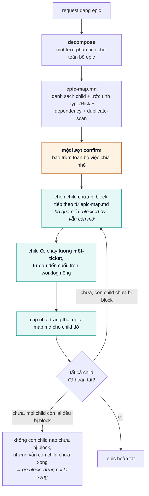

# Hướng dẫn sử dụng — ak v0.4

[English](USER-GUIDE.md) · **[Tiếng Việt](USER-GUIDE.vi.md)** · [日本語](USER-GUIDE.ja.md)

Hướng dẫn này giải thích **cách sử dụng** plugin hằng ngày.
Về cài đặt/cập nhật, xem [INSTALL.md](./INSTALL.md). Về tóm tắt lệnh theo host, xem
[MARKETPLACE.md](../MARKETPLACE.md). Về cấu trúc thiết kế, xem [STRUCTURE.md](../STRUCTURE.md).

---

## 1. Plugin này làm gì

Bắt buộc đi theo con đường **đặt yêu cầu lên hàng đầu** trước khi viết code:

1. Học / coaching domain knowledge
2. Viết acceptance criteria có thể kiểm chứng (và Risk tier)
3. Phát hiện xung đột với code hiện tại
4. **Bạn** xác nhận các quyết định (`CONFIRM G3:…`)
5. Plan → build (TDD) → **review code trung lập** → fix các phát hiện hợp lý → chạy test với bằng chứng máy
6. Checklist an toàn khi ship (G9) và checker PASS
7. **Semantic audit** (`:audit`) — G9 PASS chỉ có nghĩa mọi field đã được điền và không phải chỗ giữ
   chỗ (placeholder); nó không có nghĩa nội dung nhất quán về mặt logic (Rollback có thực sự đảo
   ngược Migration hay không, Decision có thực sự trả lời Proposal hay không). `:audit` là lớp bắt
   buộc con người xác nhận thêm bên trên, trước khi việc ship được coi là hoàn tất.

AI không được tự bịa ra PASS. `bin/check-gates.sh` là trọng tài cho cấu trúc; `:audit` cộng với chữ
ký của bạn là trọng tài cho ý nghĩa — cái này không thay thế được cái kia.

**Ngôn ngữ:** chat + setup theo **ngôn ngữ của bạn** (xem `references/locale.md`). Từ khóa gate
(`CONFIRM G3:`, PASS/FAIL) giữ nguyên tiếng Anh.

**Workspace:** mỗi project nằm dưới `~/.workspaces/<slug>/` (bên ngoài repo sản phẩm); chạy
`bin/check-workspace.sh` để xác minh cấu trúc.

**Theo từng ticket:** build/bằng chứng chỉ nằm trong `worklogs/<Ticket_ID>/` — các ticket không
dùng chung worklog.

**Sau khi xong:** `/ak:clean TICKET-123` lưu trữ worklog đó (giữ nguyên domain knowledge).

### Đặt tên (dễ nhầm lẫn)

| Từ | Nghĩa | Khi nào |
|------|--------|------|
| **confirm** (`:confirm`, G3) | Con người ký xác nhận quyết định clarify/spec | **Trước** plan/build |
| **review** (`:review`, G7) | Review diff trung lập + bằng chứng How/By | **Sau** build |
| **fix** (`:fix`) | Triage phát hiện từ review; chỉ fix lỗi hợp lý | Sau khi review FAIL (P0/P1 OPEN) |
| **test** (`:test`, G8) | Chạy test thật + SHA/CI/junit | Sau review (và `:fix` nếu cần) |
| **check** (`:check`) | Chạy `check-gates.sh` | Trước khi ship/merge |
| **audit** (`:audit`) | Đối chiếu nhất quán ngữ nghĩa + con người ký xác nhận | Sau G9 PASS, trước khi ship hoàn tất |
| **clean** (`:clean`) | Lưu trữ/xóa worklog; ngưỡng G9, audit vẫn quyết định việc hoàn tất P0/P1 | Sau G9; khuyến nghị sau khi audit bắt buộc xong |

---

## 2. Thiết lập lần đầu (một lần cho mỗi máy)

Yêu cầu: Bash 3.2+, Git, và ít nhất một host được hỗ trợ. Installer ghi các tệp tích hợp dưới home
directory của bạn nhưng không sửa source của sản phẩm. Đọc [INSTALL.md](./INSTALL.md) để biết
đường dẫn chính xác, cách cập nhật, smoke test cô lập, và xử lý sự cố.

```bash
git clone https://github.com/trongdn2405/ak.git
cd ak
bash install.sh             # chỉ Claude Code (mặc định)
bash install.sh --cursor    # chỉ Cursor
bash install.sh --codex     # chỉ Codex
bash install.sh --agy       # chỉ Antigravity; cần agy
bash install.sh --all       # mọi host; cần agy
```

Chọn một lệnh, không chạy hết tất cả các dòng. Sau đó restart/reload host đã chọn; với Codex, mở
task mới để các skill vừa cài được phát hiện.

Để gỡ workflow sau này, dùng lệnh tương ứng (`bash uninstall.sh`, `--cursor`, `--codex`, `--agy`,
hoặc `--all`). Nó chỉ xóa phần tích hợp host; clone và worklog được giữ nguyên. Xem
[INSTALL.md](./INSTALL.md#uninstall) để biết chính xác hợp đồng gỡ bỏ.

Để cập nhật, chạy `bash update.sh` với cùng flag target. Updater yêu cầu worktree sạch, fast-forward
clone, và refresh agent đó mà không đụng tới thay đổi repository cục bộ. Xem
[INSTALL.md](./INSTALL.md#update) để biết cách xử lý lỗi và xác minh.

Sau đó trong repo **sản phẩm** của bạn (khuyến nghị):

1. Copy `templates/ci/github-actions-ak.yml` → `.github/workflows/ak-gates.yml`
2. Branch protection → bắt buộc status check `ak-gates`
3. Marker tùy chọn ở root project:

```json
{ "projectSlug": "my-app" }
```

Lưu thành `.ak.json` (xem `templates/workspaces/_project/ak.json.example`).

Smoke test:

```bash
export AK_WORKSPACES_ROOT=/path/to/ak/fixtures
export AK_PLUGIN=/path/to/ak
"$AK_PLUGIN/bin/check-workspace.sh" demo
# kỳ vọng RESULT: PASS
"$AK_PLUGIN/bin/check-gates.sh" PASS-G9 --project demo --min G9 --strict
# kỳ vọng RESULT: PASS
```

---

## 3. Luồng hằng ngày cho một ticket

### 3.0 Request dạng epic

`:decompose` chạy trước khi request có dạng epic, sau đó chuyển giao luồng một-ticket cho từng child
một — nó lặp lại chính luồng dùng cho một ticket đơn ([README.md](../README.md) có sơ đồ đó):



`:decompose` ghi `epic-map.md` ở cấp project (không nằm trong worklog của bất kỳ ticket nào) và chỉ
chuyển giao child **đầu tiên** chưa bị block — nó không bao giờ tự gọi `:spec`/`:start` cho nhiều
child cùng lúc. Mỗi child có luồng một-ticket đầy đủ của riêng nó (Risk tier riêng, `CONFIRM G3`
riêng, G0–G9 + AUDIT riêng) — lượt confirm duy nhất của epic chỉ xác nhận việc chia nhỏ và các câu
hỏi ở cấp epic, không thay thế gate riêng của bất kỳ child nào. Một child P0 phát hiện trong lúc
decompose bị gate chặt chẽ y hệt như một ticket P0 phát hiện theo cách khác. `epic-map.md` chưa được
kiểm chứng với epic nhiều cấp (child tự phân nhánh tiếp) — chỉ coi sơ đồ dependency là đáng tin cho
danh sách child phẳng; nếu một child trông như cần decompose tiếp, hãy nói rõ điều đó.

### 3.1 Lần đầu trên một project

```
/ak:learning
```

Dán một brief ngắn: tên project, repo, domain.
AI tạo `~/.workspaces/<slug>/` và hỏi khi business rule chưa rõ ràng.
Bạn trả lời bằng `/ak:coaching` khi AI hiểu sai hoặc spec đã đổi.

### 3.2 Bắt đầu một ticket

```
/ak TICKET-123 https://your-tracker/TICKET-123
```

AI phân tích một lần, hỏi một lần, rồi chạy tới **điểm dừng thật đầu tiên**. Bạn cũng có thể chạy
từng stage bằng tay (bên dưới).

**Fix trivial thậm chí bỏ qua cả bước hỏi đó.** Nếu ticket có Risk=P2, chạm ≤1 file, ≤5 dòng, không
đổi định danh công khai (tên function/route/API/cột), và duplicate-scan sạch (không có nơi khác cần
đồng bộ), `:start` chạy `:build` ngay lập tức và báo cáo những gì nó đã làm thay vì hỏi trước — nói
`"full pipeline"` sau đó nếu bạn muốn hoàn tác và làm lại theo đầy đủ nghi thức. Điều này chỉ xảy ra
khi duplicate-scan sạch; nếu tìm thấy nơi khác, `:start` quay lại kiểu "đề nghị và chờ" thông thường
của P2. **Việc tự chạy không hỏi này chỉ áp dụng cho `:start`** — gọi trực tiếp
`/ak:build TICKET-123` vẫn tự phân tích trên một ticket có dạng Trivial, nhưng nó không bỏ
qua bước báo cáo trước, vì hành vi không-hỏi này gắn với bước đề nghị đầu tiên của `:start`.
Xem `references/risk.md` mục "Trivial" — ngưỡng `≤5 dòng` là một ước lượng khởi điểm chưa được
kiểm chứng, được theo dõi giống như ngưỡng chặn đếm-claim của epic-signal.

### 3.3 Spec (G1)

```
/ak:spec TICKET-123
```

Phải tạo ra `02-spec.md` với:

- Đúng một **Type:** Bug / New feature / Spec change / Requirement change / Refactor
- **Risk:** P0 / P1 / P2 (bắt buộc)
- Provenance của yêu cầu: nhãn sự thật, nguồn/trích dẫn, ngày xác minh, độ tin cậy, chủ sở hữu chưa
  giải quyết
- Các dòng AC theo kịch bản (Given / When / Then) đã điền
- NEG / PERM / EDGE khi cần
- UI state nếu Touches UI = Yes
- Nếu **P0**: điền thêm `02b-security.md`
- Nếu Touches UI = Yes: điền bảng **QA handoff — testable oracle** (nhãn field/nút thật + oracle
  có thể kiểm tra bằng máy cho từng dòng AC/NEG/PERM/EDGE). Plugin này không tự chạy QA; bảng này
  để người test tiếp theo (con người hay công cụ bên ngoài) có thể thiết kế test case chỉ từ spec,
  mà không cần hỏi dev field này tên gì hoặc "thành công" trên màn hình nghĩa là gì. Màn hình chưa
  thiết kế xong → đánh dấu dòng đó `TBD`, đừng để trống.

**Cách chọn Risk**

| Chọn | Khi nào |
|--------|------|
| **P0** | Tiền, authz/permission, PII, dữ liệu legacy, migration không thể đảo ngược |
| **P1** | Thay đổi hành vi/API bình thường (mặc định) |
| **P2** | Copy, config, docs, chore nhỏ không ảnh hưởng hành vi |

### 3.4 Clarify (G2)

```
/ak:clarify TICKET-123
```

Điền `03-clarify-report.md` + `03-qa-log.md`.
Mọi trường hợp không MATCH cần có decision + owner + date. AI hỏi mọi câu hỏi mở dưới dạng một danh
sách đánh số ngắn — trả lời bằng ngôn ngữ tự nhiên, thứ tự tùy ý, trong một tin nhắn; AI khớp câu trả
lời của bạn với đúng câu hỏi và chỉ hỏi lại những gì vẫn chưa giải quyết.

Cách điều tra thay đổi theo Type: Bug đi theo đường thực thi thực tế; New feature khảo sát một ví dụ
tương tự và các điểm chèn code; Spec change truy vết mọi consumer; Requirement change tìm mọi nơi
encode rule cũ/mới và cần có thẩm quyền được nêu tên. Ticket hỗn hợp phân loại từng claim riêng.

**Duplicate-scan chạy trên mọi ticket, không chỉ Spec/Requirement change** — một fix Bug hay một sửa
copy P2 vẫn có thể chạm vào text hoặc logic bị trùng lặp ở nơi khác. Trước khi đóng bất kỳ claim nào:
grep tìm cùng chuỗi (copy/label/message) hoặc cùng logic (rule validation, tính toán, kiểm tra quyền)
trong toàn bộ codebase. Tìm thấy nhiều hơn một chỗ → trở thành câu hỏi cho bạn ("giữ các chỗ này đồng
bộ chứ?"), không phải một quyết định âm thầm theo hướng nào cả. Xem `references/ba-integrity.md`
mục "Duplicate-scan".

### 3.5 Confirm (G3) — **bạn gửi lại phần này**

```
/ak:confirm TICKET-123
```

AI tóm tắt các quyết định, rồi đưa cho bạn một dòng sẵn sàng gửi với ticket và ngày đã điền sẵn —
bạn chỉ cần sửa tên và gửi lại:

```text
CONFIRM G3: TICKET-123 Your Name 2026-08-11
```

Nếu Risk = **P0**, thêm:

```text
CONFIRM G3-PM: TICKET-123 PM Name 2026-08-11
```

**Bạn không cần gõ lại dòng đó chính xác.** Bất kỳ câu trả lời nào rõ ràng thể hiện sự đồng ý — chỉ
một cái tên, `"ok Hoa"`, `"đồng ý, tên tôi là Hoa"` — đều đủ. AI soạn dòng chính xác từ câu trả lời
của bạn và hiển thị lại một lần để bạn thấy chính xác nội dung sẽ được ghi; dòng hiển thị lại đó trở
thành bản ghi chính thức một khi bạn không phản đối. Nếu câu trả lời của bạn không rõ ràng là đồng ý,
AI sẽ hỏi trực tiếp có/không thay vì tự suy đoán.

Quy tắc:

- AI **không được tự bịa** ra các dòng này
- Tên bị cấm: AI, ChatGPT, Claude, Copilot, Cursor, Assistant, Bot
- Các câu này phải xuất hiện trong **cả hai** `INDEX.md` và `03b-human-confirm.md`
- `03b-human-confirm.md` phải chứa `Source: user-message`

### 3.6 Plan → Build → Review → Fix → Test

```
/ak:plan   TICKET-123
/ak:build  TICKET-123
/ak:review TICKET-123
/ak:fix    TICKET-123   # chỉ khi còn phát hiện P0/P1 OPEN
/ak:test   TICKET-123
```

| Stage | Artifact | Phải bao gồm |
|-------|----------|--------------|
| plan | `04-plan.md` | Task ánh xạ theo AC/claim + bằng chứng đã tìm được lệnh chạy được |
| build | `05-impl-log.md` | Lỗi/lý do RED → kết quả GREEN + bản đồ coverage + SHA |
| review | `06-review-qa.md` | Rà soát nhóm defect + phát hiện (`path:line`) + How/By theo từng AC |
| fix | `06c-fix-log.md` | Triage FIX/SKIP/DEFER; chỉ patch hợp lý |
| test | `06b-test-evidence.md` | Sổ lệnh đã chạy, bằng chứng assertion, output, SHA, CI/junit |

**Lập trường khi review:** đánh giá **diff**, không đoán theo thói quen framework. Săn lỗi 500 /
thiếu sót / injection / case (`downcase`/`upcase`). P0/P1 OPEN → chạy `:fix` trước `:test`.
**Lập trường khi fix:** SKIP những gì chỉ liên quan style, ngoài phạm vi, hoặc gợi ý mâu thuẫn với
AC/hệ thống; không bao giờ SKIP P0 mà không có waiver của PM.

### 3.7 Check + Ship (gate merge)

```
/ak:check TICKET-123
/ak:ship  TICKET-123
```

Trước khi merge, từ terminal (hoặc CI):

```bash
export AK_PLUGIN=/path/to/ak
"$AK_PLUGIN/bin/check-gates.sh" TICKET-123 --project <slug> --min G9 --strict
```

`--strict` bật các kiểm tra chuẩn CI (SHA so với git HEAD, phân tích junit) và kéo theo
`--verify-net`.

Artifact ship `07-ship.md` trước tiên chọn một deployment profile, sau đó bao phủ migration liên
quan, feature flag, **canary %**, **soak time**, on-call, SLO, rollback, thẩm quyền thực thi, và
tín hiệu abort có thể quan sát được.
Canary `N/A` cần lý do ≥ 10 ký tự (và không được là placeholder lặp lại kiểu "abc abc abc").

### 3.7.5 Audit (nhất quán ngữ nghĩa, trước khi ship hoàn tất)

```
/ak:audit TICKET-123
```

G9 structural PASS chỉ chứng minh các field đã được điền và không phải placeholder — nó không chứng
minh nội dung nhất quán về mặt logic. `:audit` đối chiếu 8 cặp coherence (Decision với Proposal,
Rollback với Migration, đường dẫn test với AC mà chúng khẳng định bao phủ, …) kèm trích dẫn bằng
chứng từ cả hai phía, sau đó yêu cầu con người ký xác nhận thật:

```
AUDIT CONFIRM: TICKET-123 <tên bạn> <YYYY-MM-DD>
```

Cùng quy tắc chống giả mạo như `CONFIRM G3:` — tên AI/công cụ bị từ chối. Phán quyết của chính AI về
audit của chính nó là chưa đủ; đó chính xác là điểm mù mà stage này tồn tại để bắt, ở một tầng cao
hơn. Mỗi mục C1–C8 yêu cầu hai trích dẫn bằng chứng nguyên văn, một lý do không phải placeholder, và
một kết luận COHERENT/N/A đã giải quyết. Bất kỳ cặp nào thiếu, UNCLEAR, hoặc INCOHERENT đều chặn
PASS.

```bash
"$AK_PLUGIN/bin/check-gates.sh" TICKET-123 --project <slug> --min AUDIT --strict
```

### 3.8 Clean (giải phóng bộ nhớ sau ticket)

```
/ak:clean TICKET-123
```

- Mặc định: **lưu trữ** `worklogs/TICKET-123/` → `worklogs/.archive/TICKET-123-<UTC>/`
- Giữ nguyên `domain-knowledge/`, `PROJECT.md`, các ticket khác
- Yêu cầu G9 PASS trừ khi có `--force` (`clean-worklog.sh` kiểm tra `--min G9`, ngưỡng bắt buộc cho
  mọi risk tier — `:audit` là bắt buộc trước khi ship *hoàn tất* trên P0/P1 nhưng bản thân nó không
  phải điều kiện tiên quyết của `:clean`, vì ticket P2 có thể hợp lệ bỏ qua audit)
- Xóa cứng: `--purge` (xác nhận trong chat trước)

CLI:

```bash
"$AK_PLUGIN/bin/clean-worklog.sh" TICKET-123 --project <slug>
"$AK_PLUGIN/bin/clean-worklog.sh" TICKET-123 --project <slug> --force --purge
```

### 3.9 Feedback (báo cáo bug của ak)

```
/ak:feedback [điều gì đó bị sai]
```

- Dùng khi **chính ak** hoạt động sai — output của một skill, một gate, một artifact được
  tạo ra — không phải bug trong sản phẩm/ticket bạn đang xây dựng.
- Tổng hợp mọi thứ bạn đã mô tả trong phiên này, kiểm tra `gh issue list` để tìm trùng lặp đã có,
  rồi hỏi bạn xác nhận từng title/body trước khi tạo issue.
- Tạo issue qua `gh issue create --repo trongdn2405/ak`; báo lại URL issue, hoặc lý do một
  mục bị bỏ qua (trùng lặp, bị từ chối).
- Yêu cầu `gh` đã cài đặt và xác thực (`gh auth status`). Bất kỳ tài khoản GitHub đã xác thực nào
  cũng có thể mở issue trên repo public — không cần quyền write.

---

## 4. Bảng tra cứu nhanh các lệnh

| Lệnh | Khi nào dùng | Bạn phải cung cấp |
|---------|-------------|------------------|
| `:learning` | Project mới / knowledge trống | Brief hoặc path |
| `:coaching` | AI sai / spec đã đổi | Chủ đề + sửa lỗi |
| `:start` | Bắt đầu ticket | Ticket ID tùy chọn (tự suy ra nếu bỏ trống); + URL |
| `:spec` | Làm rõ requirement | Ticket ID tùy chọn (tự suy ra nếu bỏ trống); đặt Risk |
| `:clarify` | Spec so với code | Ticket ID tùy chọn (tự suy ra nếu bỏ trống) |
| `:confirm` | Trước bất kỳ plan/code nào | `CONFIRM G3:…` **của bạn** |
| `:plan` | Sau khi G3 PASS | Ticket ID tùy chọn (tự suy ra nếu bỏ trống) |
| `:build` | Triển khai | Ticket ID tùy chọn (tự suy ra nếu bỏ trống) |
| `:review` | Review diff + bằng chứng | Ticket ID |
| `:fix` | Triage/fix phát hiện từ review | Ticket ID (sau khi có P0/P1 OPEN) |
| `:test` | Chạy test thật | Ticket ID + field máy |
| `:check` | Chạy checker | Ticket ID; tùy chọn slug / G8\|G9\|AUDIT |
| `:ship` | Ghi chú trước merge | Ticket ID |
| `:audit` | Nhất quán ngữ nghĩa + con người ký xác nhận | Ticket ID (sau G9 PASS) |
| `:clean` | Lưu trữ/xóa worklog ticket | Ticket ID; tùy chọn `--force` / `--purge` |
| `:status` | Tôi đang ở đâu? | Ticket ID tùy chọn |
| `:feedback` | Báo cáo bug/điểm khó chịu của ak | Mô tả tự do |

Không có Ticket ID? `:start`/`:spec`/`:clarify`/`:plan`/`:build` vẫn chạy — không có gì bị từ chối.
Nếu công việc cần ghi lại một quyết định, AI tự suy ra một tên `adhoc-<slug>` ngắn từ chính task đó
(ví dụ `adhoc-confirm-btn-text`) và báo cho bạn một lần. Nếu không cần lưu gì cả (một câu hỏi, một
tra cứu chỉ-đọc, một claim được giải quyết gọn gàng), không có worklog nào được ghi và không tên nào
được bịa ra.

---

## 5. Tệp worklog (theo từng ticket)

Được tạo dưới `~/.workspaces/<project-slug>/worklogs/<Ticket_ID>/`:

| Tệp | Vai trò | Gate |
|------|------|------|
| `INDEX.md` | Status, Type, Risk, Pilot, waiver, dòng CONFIRM | tất cả |
| `02-spec.md` | Intent, Type/Risk, provenance, AC/NEG/PERM/EDGE, UI oracle | G1 |
| `02b-security.md` | Threat / secrets / contract (**chỉ P0**) | G1 |
| `03-clarify-report.md` | Claim MATCH/NO/UNCLEAR | G2 |
| `03-qa-log.md` | Câu hỏi mở | G5 |
| `03b-human-confirm.md` | Nội dung CONFIRM chính xác của con người | G3 |
| `04-plan.md` | Task | G4 |
| `05-impl-log.md` | Bản đồ coverage | G6 |
| `06-review-qa.md` | Phát hiện từ diff + How verified | G7 |
| `06c-fix-log.md` | Triage / fix đã áp dụng | (khắc phục) |
| `06b-test-evidence.md` | Test + SHA/CI/junit | G8 |
| `07-ship.md` | An toàn khi ship | G9 |
| `08-semantic-audit.md` | Cặp coherence + con người ký `AUDIT CONFIRM:` | AUDIT |

---

## 6. Các gate (G0–G9 + AUDIT) trong một bảng

Bảng này là bản tóm tắt cho người đọc. `references/stage-contract.md` là nguồn thẩm quyền — nếu hai
bên khác nhau, tệp contract thắng; sửa tệp đó trước, rồi mới đồng bộ bảng này.

| Gate | PASS nghĩa là | Nếu FAIL thì chạy |
|------|------------|-------------|
| G0 | Domain knowledge đã sẵn sàng | `:learning` / `:coaching` |
| G1 | Một Type + Risk, provenance, AC (+ security nếu P0) | `:spec` |
| G2 | Xung đột đã được quyết định | `:clarify` |
| G3 | Human CONFIRM trong INDEX + `03b` | `:confirm` |
| G4 | Plan đã ánh xạ | `:plan` |
| G5 | Không còn câu hỏi OPEN | `:clarify` |
| G6 | Coverage + test đã ghi log PASS | `:build` |
| G7 | Review: không còn P0/P1 OPEN + bằng chứng đã điền | `:review` / `:fix` |
| G8 | Bằng chứng test + field máy | `:test` |
| G9 | An toàn khi ship đã hoàn tất | `:ship` |
| AUDIT | Structure PASS (G0–G9) là cần thiết nhưng chưa đủ — mục này kiểm tra các claim trong worklog có nhất quán với nhau không (Rollback với Migration, Decision với Proposal, …) và yêu cầu con người ký `AUDIT CONFIRM:` thật, không chỉ phán quyết của AI | `:audit` |

**Fast lane P2:** G2/G3/G4/G5/G7 là mềm (chỉ cảnh báo) trừ khi `--strict` — một ticket P2 nhỏ,
không ảnh hưởng hành vi có thể bỏ qua hoàn toàn vòng `CONFIRM G3` của con người.
**Trivial (bộ lọc trên P2, không phải tier mới):** ≤1 file, ≤5 dòng, không đổi định danh công khai,
duplicate-scan sạch → `:start` bỏ qua cả bước "đề nghị và chờ" của P2 và chạy thẳng `:build`, báo cáo
sau khi đã làm. Quay lại P2 bình thường nếu duplicate-scan tìm thấy nơi khác. Xem `references/risk.md`
mục "Trivial".
**P0:** không WAIVE trên G3/G8; dual confirm; bắt buộc có file security.
**Hoàn tất P0/P1:** G9 là structural; AUDIT cộng con người ký xác nhận là bắt buộc.

Định dạng dòng WAIVE trên INDEX:

```text
- G4/task-3 | reason | owner | 2026-12-31 | PM note
```

---

## 7. Pilot (chứng minh workflow hiệu quả)

1. Copy `templates/pilot-metrics.md` → `~/.workspaces/<slug>/pilot/PILOT-v0.4.md`
2. Điền khối **Scores (machine)** với số liệu baseline
3. Trên các ticket pilot, đặt `Pilot: ☑ yes` trong INDEX
4. Sau 10 ticket:

```bash
./bin/pilot-score.sh ~/.workspaces/<slug>/pilot/PILOT-v0.4.md
# kỳ vọng RESULT: PASS
```

Ngưỡng thành công: mỗi chỉ số miss-spec / reopen / escape ≤ một nửa baseline; `gate_blocks ≥ 1`;
`tickets_completed ≥ 10`.

---

## 8. Xử lý sự cố

| Triệu chứng | Cách sửa |
|---------|-----|
| `worklog not found` | `cd` vào product project, hoặc đặt `AK_WORKSPACES_ROOT` / `--project <slug>` |
| G3 FAIL thiếu CONFIRM | Gõ đúng câu; đảm bảo có cả INDEX và `03b-human-confirm.md` |
| G3 FAIL tên AI | Dùng tên người thật, không phải Claude/Cursor/… |
| G8 FAIL SHA | Đưa `git rev-parse HEAD` thật vào bảng bằng chứng máy |
| G8 FAIL junit | Đường dẫn phải tồn tại; XML phải có `failures="0"` |
| G9 FAIL canary N/A | Thêm lý do: `N/A (internal tool, no canary)` |
| AUDIT FAIL bằng chứng trích dẫn | Thêm hai trích dẫn nguồn chính xác và một REASON thật cho mỗi cặp C1–C8 |
| Lệnh đã cài nhưng không thấy | Restart/reload host; chạy lại installer; kiểm tra đường dẫn trong `INSTALL.md` |
| Checker PASS nhưng PR vẫn merge được mà không cần nó | Bật required status check từ CI template |

---

## 9. Tài liệu liên quan

| Tài liệu | Nội dung |
|-----|---------|
| [README.md](../README.md) | Tổng quan + cài đặt + danh mục lệnh |
| [INSTALL.md](./INSTALL.md) | Cài đặt, cập nhật, xác minh, đường dẫn theo host |
| [references/risk.md](../references/risk.md) | P0/P1/P2 + timebox |
| [references/security.md](../references/security.md) | Quy tắc file security cho P0 |
| [references/pilot.md](../references/pilot.md) | Vận hành pilot |
| [references/maturity.md](../references/maturity.md) | Rubric chuyên gia |
| [references/enforce.md](../references/enforce.md) | Flag của checker |
| [MARKETPLACE.md](../MARKETPLACE.md) | Cài đặt theo host |
| [CONTRIBUTING.md](../CONTRIBUTING.md) | Phát triển plugin |
